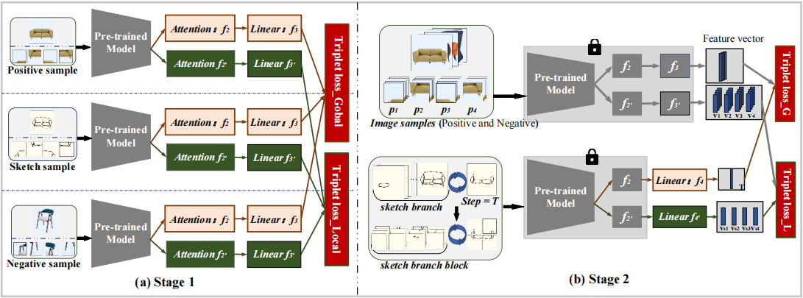

# LGRL
LOCAL-GLOBAL REPRESENTATION LEARNING FOR ON-THE-FLY FG-SBIR

https://user-images.githubusercontent.com/107622162/197939613-a3944d69-a58a-4576-a4ea-9ab7f12ce77c.mp4

**This repository is the official pytorch implementation of our paper, \*LOCAL-GLOBAL REPRESENTATION LEARNING FOR ON-THE-FLY FG-SBIR\*.**

## 🌟 Pipeline

## 💾 Dataset

We use two standard datasets as follows:

**The [QMUL-Shoe-V2](http://sketchx.eecs.qmul.ac.uk/downloads/) dataset** contains 6730 sketches and 2000 photos. A total of 6051 sketches and 1800 photos were used to train the models, and the rest were used to test the models. 

**The [QMUL-Chair-V2](http://sketchx.eecs.qmul.ac.uk/downloads/) dataset** contains 2000 sketches and 400 photos. A total of 1275 sketches and 300 photos were used to train the models, and the rest were used to test the models.

## 🧪 Example

## ⏳ To Do

- [ ] Release training code

- [ ] Release testing code
- [ ] Release pre-trained models

## 📔 Citation

coming soon......

## 💡 Acknowledgments

*We would like to thank all of reviewers for their constructive comments and CQUPT for supporting.*

## 📨 Contact

This repo is currently maintained by Dawei Dai (dw_dai@163.com) and his master's student Yingge Liu (s200231105@stu.cqupt.edu.cn).
